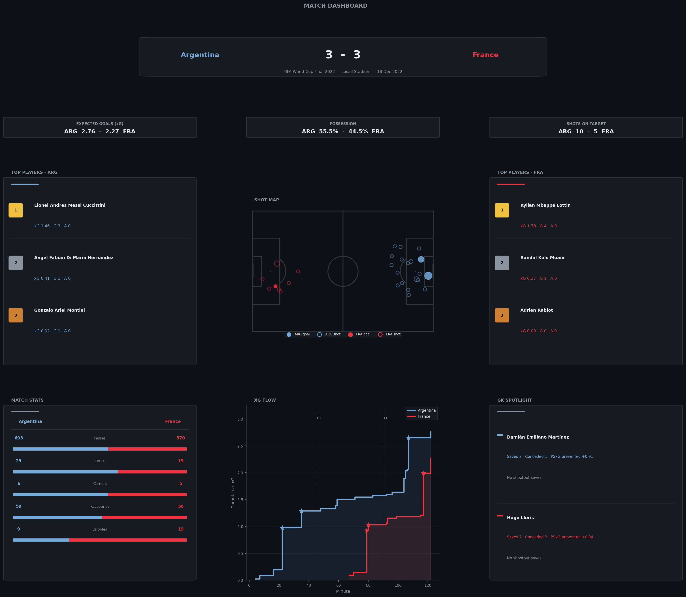

# Football Analytics Dashboard

Interactive web dashboard for football match analysis, powered by [StatsBomb open data](https://github.com/statsbomb/open-data).

Built as a full-stack conversion of a Jupyter notebook — the same visualisations, but live in the browser.

**Default match:** 2022 FIFA World Cup Final — Argentina 3–3 France (Lusail Stadium, 18 Dec 2022)



---

## Stack

| Layer    | Technology |
|----------|------------|
| Backend  | Python · FastAPI · StatsBombPy · Pandas |
| Frontend | React · Vite · Recharts |
| Data     | StatsBomb Open Data (free, no API key needed) |

---

## Project Structure

```
Daldoul/
├── backend/
│   ├── main.py                        # FastAPI app + CORS
│   ├── requirements.txt
│   └── services/
│       └── match_service.py           # All data fetching & computations
├── frontend/
│   ├── src/
│   │   ├── App.jsx                    # Router + sidebar layout
│   │   ├── api/matchApi.js            # Fetch wrapper
│   │   ├── components/                # Reusable UI components
│   │   │   ├── Header.jsx
│   │   │   ├── StatBox.jsx
│   │   │   ├── TopPlayers.jsx
│   │   │   ├── ShotMap.jsx            # SVG pitch + shot bubbles
│   │   │   ├── MatchStats.jsx         # Split comparison bars
│   │   │   ├── XGFlow.jsx             # Cumulative xG line chart
│   │   │   ├── GKSpotlight.jsx
│   │   │   └── Sidebar.jsx            # Collapsible nav sidebar
│   │   └── pages/
│   │       ├── MatchOverview.jsx      # Main dashboard page
│   │       └── ComingSoon.jsx         # Placeholder for planned pages
└── footballprojects/
    └── Untitled.ipynb                 # Original notebook (reference)
```

---

## Getting Started

### Prerequisites

- Python 3.9+
- Node.js 18+

### 1 — Backend

```bash
cd backend
python -m pip install -r requirements.txt
python -m uvicorn main:app --reload --port 8000
```

The first request downloads ~3 000 match events from StatsBomb — expect a 20–30 second wait on the first load. The API will be available at `http://localhost:8000`.

### 2 — Frontend

Open a second terminal:

```bash
cd frontend
npm install
npm run dev
```

Then open `http://localhost:5173` in your browser.

---

## API

| Endpoint | Description |
|----------|-------------|
| `GET /api/match/{match_id}` | Returns all dashboard data for a match |
| `GET /health` | Health check |

### Response shape

```json
{
  "meta":        { "team1", "team2", "score1", "score2", "venue", "date" },
  "statBoxes":   { "xg", "possession", "shotsOnTarget" },
  "topPlayers":  { "Argentina": [...], "France": [...] },
  "shotMap":     [{ "team", "x", "y", "xg", "outcome" }, ...],
  "matchStats":  { "Argentina": { "passes", "fouls", "corners", "recoveries", "dribbles" } },
  "xgFlow":      { "Argentina": [{ "minute", "cumxg", "isGoal" }] },
  "goalkeepers": [{ "team", "player", "saves", "conceded", "psxgPrevented", "penaltiesSaved" }]
}
```

To load a different match, find the `match_id` from StatsBomb and change the constant in `frontend/src/pages/MatchOverview.jsx`.

---

## Dashboard Panels

| Panel | Description |
|-------|-------------|
| **Match Overview** | Score, venue, date |
| **Stat Boxes** | xG, Possession %, Shots on Target |
| **Top Players** | Top 3 per team ranked by goals then xG |
| **Shot Map** | All non-penalty shots on a StatsBomb pitch (filled = goal) |
| **Match Stats** | Split bars for Passes, Fouls, Corners, Recoveries, Dribbles |
| **xG Flow** | Cumulative xG over time with goal markers |
| **GK Spotlight** | Saves, goals conceded, PSxG prevented, shootout saves |

---

## Planned Pages

The sidebar includes stubs for 9 future analysis pages:

- **xG Timeline** — rolling xG window with momentum swings
- **Shot Analysis** — xG distribution, distance scatter, body part breakdown
- **Pass Network** — player node graph weighted by pass volume
- **Player Heatmaps** — KDE touch location maps per player
- **Top Performers** — sortable stat leaderboard + radar charts
- **Duels & Pressure** — pressure map, PPDA, duel win % by zone
- **Defensive Actions** — tackles, interceptions, clearances mapped on pitch
- **Set Pieces** — corner delivery map, free kick xG breakdown
- **Momentum Chart** — rolling event volume showing game control over time

Each page shows the planned metrics and points to the backend service file to add the endpoint.
